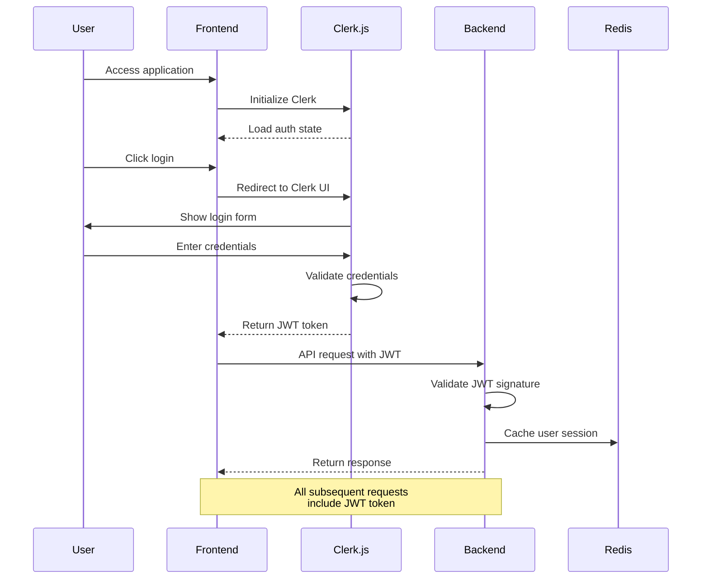
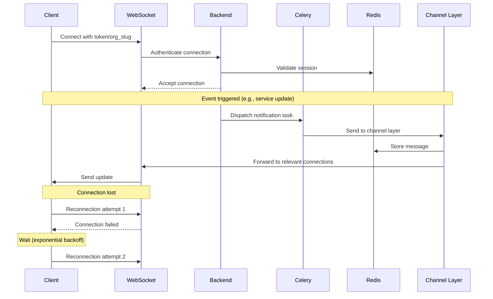
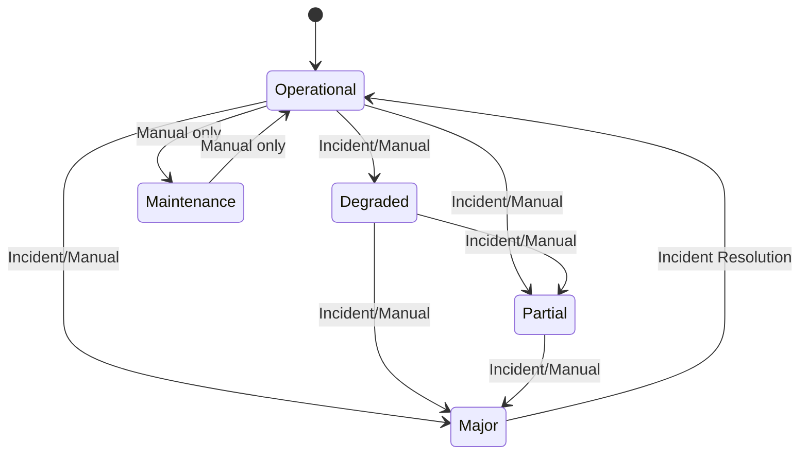
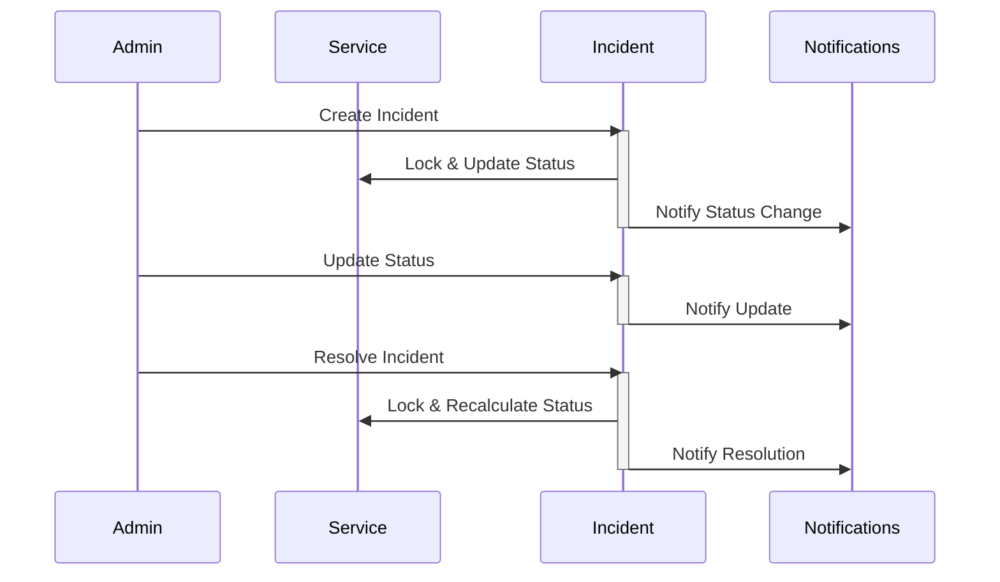

# Status Page

A modern, real-time status page system built with Django and React. Monitor your services, manage incidents, and keep your users informed with real-time updates.

## Features

- 🚀 Real-time updates via WebSockets
- 🔒 Multi-tenant architecture with organization isolation
- 👥 Role-based access control (Admin/Member)
- 📱 Responsive design for all devices
- ⚡ Public and private status pages
- 🔔 Real-time incident management
- 📊 Service status monitoring
- 🔄 Automatic reconnection with exponential backoff
- 🛡️ Rate limiting on public endpoints

## Architecture

### System Components

```
┌─────────────┐     ┌─────────────┐     ┌─────────────┐
│   React     │     │   Django    │     │   Redis     │
│  Frontend   │◄───►│   Backend   │◄───►│   Server    │
└─────────────┘     └─────────────┘     └─────────────┘
                          ▲     ▲               ▲
                          │     │               │
                          │     │____           │
                          ▼          │          │
                    ┌─────────────┐  │   ┌─────────────┐
                    │ PostgreSQL  │  │   │   Daphne    │
                    │  Database   │  │   │  WebSocket  │
                    └─────────────┘  │   └─────────────┘
                       (Supabase)    │        ▲
                                    │         │
                                    │-►┌─────────────┐
                                       │   Celery    │
                                       │   Workers   │
                                       └─────────────┘
```

## Authentication & Authorization

1. **Authentication Flow**
   ```
   User → Clerk.js → JWT Token → Backend Validation
   ```

2. **WebSocket Authentication**
   - Private connections: JWT token validation
   - Public connections: Organization slug validation

3. **Role-Based Access**
   - Admins: Full CRUD access
   - Members: Read-only access
   - Public: Limited read access

## Fault Tolerance

1. **WebSocket Connections**
   - Exponential backoff for reconnection attempts
   - Maximum retry attempts configuration
   - Automatic cleanup of stale connections

2. **Rate Limiting**
   - Public endpoints: 50 requests/second
   - WebSocket connection throttling
   - Redis-based rate limiting storage

3. **Error Handling**
   - Graceful degradation
   - Comprehensive error logging
   - User-friendly error messages

## API Documentation

### REST Endpoints

1. **Services**
   - `GET /api/v1/services/` - List services
   - `POST /api/v1/services/` - Create service (Admin only)
   - `PATCH /api/v1/services/{id}/` - Update service (Admin only)
   - `DELETE /api/v1/services/{id}/` - Delete service (Admin only)

2. **Incidents**
   - `GET /api/v1/incidents/` - List incidents
   - `POST /api/v1/incidents/` - Create incident (Admin only)
   - `PATCH /api/v1/incidents/{id}/` - Update incident (Admin only)
   - `DELETE /api/v1/incidents/{id}/` - Delete incident (Admin only)

3. **Public Endpoints**
   - `GET /api/v1/public/{org_slug}/services/` - List public services for an organization
   - `GET /api/v1/public/{org_slug}/incidents/` - List public incidents for an organization
   - `GET /api/v1/public/{org_slug}/status/` - Get overall status for an organization
   - `ws://host/ws/status/public/{org_slug}/` - Public WebSocket endpoint for real-time updates

### WebSocket Events

1. **Connection URLs**
   - Private WebSocket: `ws://host/ws/status/org/{org_id}/?token={jwt_token}`
   - Public WebSocket: `ws://host/ws/status/public/{org_slug}/`

2. **Message Types**

   a. **Service Status Updates**
   ```json
   {
     "type": "service_status_update",
     "data": {
       "id": "service_id",
       "status": "operational",
       "name": "Service Name",
       "description": "Service Description",
       "status_display": "Operational"
     }
   }
   ```

   b. **Incident Updates**
   ```json
   {
     "type": "incident_update",
     "data": {
       "id": "incident_id",
       "status": "investigating",
       "title": "Incident Title",
       "description": "Incident Description",
       "status_display": "Investigating",
       "service": {
         "id": "service_id",
         "name": "Service Name"
       }
     }
   }
   ```

3. **Connection Behavior**
   - Both connections implement exponential backoff for reconnection attempts
   - Maximum 5 reconnection attempts before requiring manual refresh
   - Reconnection delay starts at 1000ms and doubles with each attempt
   - Public connections are rate-limited to prevent abuse
   - Private connections require valid JWT token that is validated on connection

4. **Event Flow**
   - Service/Incident updates are sent in real-time as they occur
   - All updates are sent to all connected clients for the organization, over public or private connections, depending on the user auth.

## Code Structure

<details>
<summary><strong>Frontend Structure</strong></summary>

### Core Modules

1. **Pages (`/src/pages/`)**
   - `Dashboard.tsx` - Main dashboard for authenticated users
   - `PublicDashboard.tsx` - Public status page with real-time updates
   - `Services.tsx` - Service management interface
   - `Incidents.tsx` - Incident management and tracking
   - `Settings.tsx` - Organization and user settings
   - `Login.tsx` - Authentication interface using Clerk.js

2. **Components (`/src/components/`)**
   - `ServiceList.tsx` - Reusable service grid with status indicators
   - `IncidentModal.tsx` - Form for creating/updating incidents
   - `ServiceModal.tsx` - Form for creating/updating services
   - `Pagination.tsx` - Reusable pagination component
   - `Layout.tsx` - Main application layout with navigation
   - `PrivateRoute.tsx` - Route wrapper for authentication

3. **Utils (`/src/utils/`)**
   - `websocket.ts` - WebSocket connection management and real-time updates
   - `auth.ts` - Authentication utilities and hooks
   - `api.ts` - API client and request handlers
   - `types.ts` - TypeScript type definitions

4. **State Management**
   - React Query for server state
   - React Context for authentication state
   - Local state for UI components

5. **Styling**
   - TailwindCSS for utility-first styling
   - Material-UI components for complex interfaces
   - Custom CSS modules for specific components

</details>

<details>
<summary><strong>Backend Structure</strong></summary>

### Core Applications

1. **Core (`/backend/core/`)**
   - `consumers.py` - WebSocket consumers for real-time updates
   - `middleware.py` - Custom middleware for auth and org context
   - `throttling.py` - Rate limiting configuration
   - `permissions.py` - Custom permission classes

2. **Services (`/backend/services/`)**
   - `models.py` - Service and status definitions
   - `views.py` - API endpoints for service management
   - `serializers.py` - Data serialization/validation
   - `tasks.py` - Background tasks for service updates

3. **Incidents (`/backend/incidents/`)**
   - `models.py` - Incident and status definitions
   - `views.py` - Incident management endpoints
   - `serializers.py` - Incident data serialization
   - `tasks.py` - Background tasks for incident updates

4. **Organizations (`/backend/organizations/`)**
   - `models.py` - Organization and membership models
   - `views.py` - Organization management endpoints

5. **Users (`/backend/users/`)**
   - `models.py` - User and membership models
   - `views.py` - User management endpoints

6. **Infrastructure**
   - Redis for caching and real-time messages
   - Celery for async task processing
   - Daphne for WebSocket handling
   - PostgreSQL on Supabase for persistent storage

7. **Testing**
   - Unit tests for models and utilities
   - Integration tests for API endpoints
   - WebSocket connection tests
   - Async task testing

</details>


## Detailed System Interactions

### 1. Authentication Flow



**Process Description:**
1. User accesses the application
2. Frontend initializes Clerk.js for authentication
3. User clicks login and is presented with Clerk's login UI
4. After successful authentication:
   - Clerk.js provides a JWT token
   - Token is stored in browser
   - All API requests include this token
5. Backend validates the token for each request:
   - Verifies JWT signature using Clerk's public key
   - Checks token expiration and claims
   - Caches user session in Redis for performance

### 2. Real-time Updates Flow



**Process Description:**
1. WebSocket Connection:
   - Client initiates connection with authentication
   - Backend validates credentials
   - Connection added to appropriate channels

2. Update Flow:
   - Backend receives update (e.g., service status change)
   - Creates Celery task for async processing
   - Task publishes to Redis channel layer
   - Channel layer broadcasts to relevant WebSocket connections

3. Fault Tolerance:
   - Connection loss triggers reconnection
   - Exponential backoff between attempts
   - Maximum retry limit enforced

### 3. Multi-tenancy and Data Isolation

```
┌────────────────────────────────────────┐
│              Organization A            │
├─────────────┬──────────────┬───────────┤
│  Services   │  Incidents   │   Users   │
└─────────────┴──────────────┴───────────┘

┌────────────────────────────────────────┐
│              Organization B            │
├─────────────┬──────────────┬───────────┤
│  Services   │  Incidents   │   Users   │
└─────────────┴──────────────┴───────────┘
```

**Implementation Details:**
1. Database Level:
   - Every model includes `org_id` foreign key
   - Database constraints enforce isolation
   - Indexes optimized for org-scoped queries

2. Application Level:
   - Middleware injects org context
   - QuerySets filtered by org
   - Permissions checked against org membership

3. API Level:
   - JWT contains org claims
   - Rate limits per org
   - Separate WebSocket channels per org


## Service Status Management

Services in the system can exist in one of five states:
- **Operational**: The default state indicating normal service operation
- **Degraded Performance**: Service is running but experiencing performance issues
- **Partial Outage**: Service is partially unavailable
- **Major Outage**: Service is completely unavailable
- **Under Maintenance**: Service is undergoing planned maintenance. *This is not implemented yet.*

Status transitions can occur in two ways:
1. **Manual Updates**: Organization administrators can directly update a service's status via the UI.
2. **Incident-Driven Updates**: Service status changes automatically when incidents are created or resolved

The system enforces a strict state transition policy for incident creation:
- From **Operational**: Can transition to Degraded, Partial, or Major
- From **Degraded**: Can transition to Partial or Major
- From **Partial**: Can only transition to Major
- From **Major** and **Maintenance**: No further incident-driven transitions allowed



## Incident Management Workflow

Incidents follow a defined lifecycle with automatic service status management:

1. **Creation**:
    - Incidents are bound to a service. 
   - Captures initial service state (`from_state`)
   - Updates service to new state (`to_state`)
   - Starts in "Investigating" status
   - Triggers real-time notifications

2. **Status Progression**:
   - Investigating → Identified → Monitoring → Resolved
   - Cannot reopen resolved incidents
   - Must create new incident for recurring issues

3. **Resolution**:
   - Sets `resolved_at` timestamp
   - Recalculates service status:
     - If other active incidents exist: Uses most recent incident's state
     - If no active incidents: Returns to "Operational"
   - Triggers notifications via Celery tasks

4. **Deletion**:
   - Supports soft deletion with audit trail
   - Triggers notifications for all subscribers
   - Updates service status if needed


## Local Development Setup

### Prerequisites
- Python 3.9+
- Node.js 16+
- Redis Server
- PostgreSQL 14+
- Poetry (Python dependency management)
- pnpm (Node.js package manager)

### Backend Setup

1. **Clone the Repository**
   ```bash
   git clone <repository-url>
   cd status-page
   ```

2. **Set Up Python Environment**
   ```bash
   cd backend
   python3 -m venv venv
   source venv/bin/activate
   pip install -r requirements.txt
   ```

3. **Configure Environment Variables**
   ```bash
   cp .env.example .env
   # Edit .env with your configuration:
   # - Database URL
   # - Redis URL
   # - Clerk API keys
   # - Other settings
   ```

4. **Set Up Database**
   ```bash
   python manage.py makemigrations
   python manage.py migrate
   python manage.py createsuperuser (if needed)
   ```

5. **Start Development Server**
   ```bash
   chmod +x ./run_daphne.sh
   ./run_daphne.sh
   ```

### Redis Setup

1. **Install Redis (MacOS)**
   ```bash
   brew install redis
   ```

2. **Start Redis Server**
   ```bash
   redis-server
   ```

### Celery Workers

1. **Start Celery Worker**
   ```bash
   cd backend
   celery -A core worker -l INFO
   ```

2. **Start Celery Beat (for scheduled tasks - not needed for now)**
   ```bash
   celery -A core beat -l INFO
   ```

### Frontend Setup

1. **Install Dependencies**
   ```bash
   cd frontend
   npm install
   ```

2. **Configure Environment**
   ```bash
   cp .env.example .env
   # Edit .env with your configuration:
   # - API URL
   # - WebSocket URL
   # - Clerk publishable key
   ```

3. **Start Development Server**
   ```bash
   npm run dev
   ```

### Running the Full Stack

1. Start services in this order:
   - Redis server
   - PostgreSQL database
   - Django backend
   - Celery worker
   - Celery beat - not needed for now
   - Frontend development server

2. Access the application:
   - Frontend: http://localhost:3000
   - Backend API: http://localhost:8000
   - Admin interface: http://localhost:8000/admin


4. **Code Quality**
   ```bash
   # Backend
   black .

   # Frontend
   npm run lint
   npm run format
   ``` 